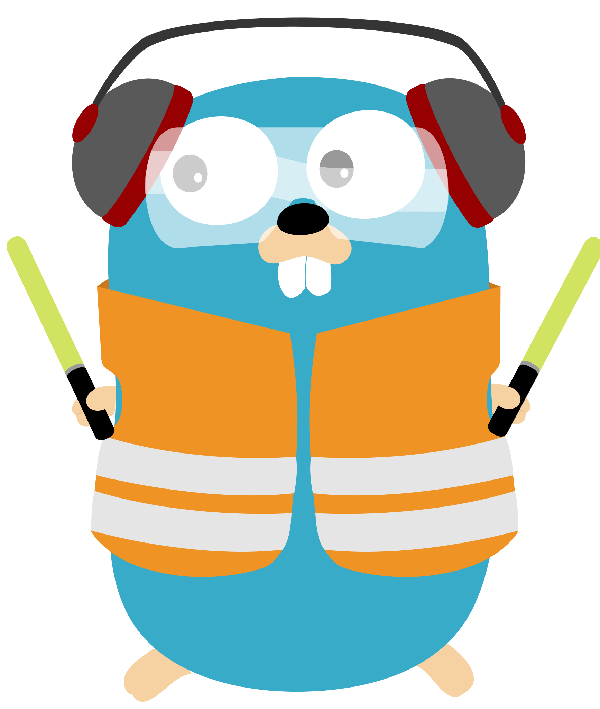

# 🚀 SteamPunk Homelab

Welcome to my cyberpunk-themed homelab — a playground where learning, automation, and entertainment collide.  
Powered by Unraid, Docker, and secured through Traefik and Cloudflare Tunnels, this environment balances serious production reliability with a spirit of experimentation.

> "It's not just a homelab — it's a lifestyle."

---

## 🛡️ Principles

- **Containerization First**: All services are deployed in isolated containers to ensure modularity, resilience, and effortless scalability.
- **Secure Ingress and Traffic Control**: All inbound and internal traffic is dynamically routed with SSL encryption, strict routing policies, and minimal attack surface exposure.
- **Identity and Access Governance**: Centralized authentication and fine-grained access controls are enforced across all services, ensuring that only trusted identities gain appropriate access to protected resources.
- **Zero-Trust External Access**: External connectivity operates under a zero-trust model, leveraging encrypted tunnels and forward authentication to prevent unauthorized entry.
- **Resilient Storage Architecture**: Storage combines fast NVMe caching with a robust hard drive array to balance performance, redundancy, and expansion without compromising data integrity.
- **Holistic System Monitoring and Automation**: System health, automation, and backup processes are fully integrated across storage and service layers to ensure uptime, efficiency, and rapid recovery capabilities.
- **Open-Source Ethos**: The environment is designed around open-source solutions, prioritizing transparency, adaptability, and community-driven innovation.
- **Continuous Optimization and Fortification**: All systems undergo continuous evaluation and refinement to improve performance, bolster security, and integrate the latest technological advancements.
- **Purpose-Driven Design**: Every deployed component is selected based on long-term reliability, operational excellence, and alignment with the homelab’s evolving mission.

---

# Enterprise-Grade Homelab Infrastructure Stack

## 🎬 Media Services & Processing Pipeline

| Logo | Service | Technical Specifications |
|:----:|:--------|:-------------------------|
|  | **Jellyfin** | FOSS media streaming server with hardware transcoding support (VAAPI/NVENC), multi-user capabilities, and robust metadata scraping architecture. |
|  | **EmbyServer** | Media delivery platform featuring advanced metadata enrichment and low-latency adaptive bitrate streaming. |
|  | **Tautulli** | Comprehensive analytics and monitoring solution for Plex/Emby services, providing detailed metrics, user activity tracking, and notification frameworks. |
|  | **Radarr** | Automated media acquisition system with API integration for indexers, quality-based file analysis, and intelligent movie collection management. |
|  | **Sonarr** | Episodic content management system featuring scene naming conversion, automated metadata retrieval, and scheduled task execution for TV series. |
|  | **Overseerr** | Centralized request management interface with OAuth2 authentication, webhook integration, and robust API endpoints for media library operations. |
|  | **Recyclarr** | Automated configuration synchronization utility for Radarr/Sonarr, facilitating standardized quality profiles and scoring algorithms across instances. |

## 📊 Observability & Monitoring Infrastructure

| Logo | Service | Technical Specifications |
|:----:|:--------|:-------------------------|
|  | **Netdata** | High-resolution, real-time performance monitoring platform with sub-second data collection, custom alert configurations, and distributed node capabilities. |
|  | **Glances** | Cross-platform system monitoring solution with RESTful API access, real-time resource utilization visualization, and modular plugin architecture. |
|  | **Homepage** | Service aggregation dashboard featuring templated service schemas, dynamic health checking, and customizable widget components. |
|  | **Dashy** | Application portal with configurable service discovery, stateless widget infrastructure, and customizable keybinding support. |
|  | **Speedtest Tracker** | Network performance monitoring solution with scheduled testing, metrics persistence, and anomaly detection capabilities. |
|  | **GoAccess-NPMlogs** | Real-time web log analyzer with terminal-based UI, statistical computations, and GeoIP resolution for NGINX Proxy Manager access logs. |

## 🧰 Development & Utility Framework

| Logo | Service | Technical Specifications |
|:----:|:--------|:-------------------------|
|  | **Code-Server** | Containerized VS Code IDE with extension support, git integration, and multi-terminal functionality for remote development. |
|  | **RustDesk Server** | Self-hosted remote desktop infrastructure with end-to-end encryption, low-latency protocol implementation, and cross-platform client support. |
|  | **Docker Socket Proxy** | Security-hardened Docker API access layer with fine-grained permission control and request filtering for containerized applications. |

## ☁️ Storage & Content Management Systems

| Logo | Service | Technical Specifications |
|:----:|:--------|:-------------------------|
|  | **Nextcloud AIO** | Comprehensive cloud platform with WebDAV compliance, object storage capabilities, collaborative document editing, and extensive API integration options. |
|  | **Immich** | Machine learning-enhanced photo management solution with EXIF processing, facial recognition, and RAW file support via optimized storage architecture. |
|  | **PhotoPrism** | TensorFlow-powered media analysis platform with automated image classification, geocoding integration, and progressive web app functionality. |
|  | **Syncthing** | Block-level, peer-to-peer file synchronization protocol implementing differential synchronization and TLS-secured transfer channels. |
|  | **Seafile** | Enterprise file hosting platform with block-level deduplication, client-side encryption, and delta-sync capabilities for efficient version control and file distribution. |
|  | **Paperless-NGX** | Document management system featuring OCR processing, automated metadata extraction, tagging taxonomies, and full-text search indexing for paperless workflows. |

## 🔒 Network Security & Access Control Infrastructure

| Logo | Service | Technical Specifications |
|:----:|:--------|:-------------------------|
|  | **Traefik** | Label-based reverse proxy implementing automated certificate management, dynamic service discovery, and middleware-enhanced request processing. |
|  | **NGINX** | High-performance HTTP server and reverse proxy with optimized event-driven architecture, upstream load balancing, and advanced caching capabilities. |
|  | **Authentik** | Identity provider with OIDC/SAML implementation, multi-factor authentication capabilities, and flow-based authorization policies. |
|  | **CrowdSec** | Distributed intrusion prevention system featuring behavioral analysis, collaborative threat intelligence sharing, and automated remediation workflows. |
|  | **Pi-hole** | Network-wide DNS sinkhole implementing adlist-based filtering, DHCP management, and detailed query analytics. |
|  | **Unbound** | Validating, recursive DNS resolver with DNSSEC support, query minimization, and caching optimization for reduced latency. |
|  | **Cloudflare Tunnel** | Zero-trust network connectivity solution leveraging outbound-only connections, identity-based access controls, and TLS 1.3 encrypted transport. |

## 🗄️ Database & Persistence Layer

| Logo | Service | Technical Specifications |
|:----:|:--------|:-------------------------|
|  | **PostgreSQL** | ACID-compliant relational database with advanced indexing, JSON support, and partitioning capabilities for Authentik and Immich services. |
|  | **MariaDB** | High-performance transactional database engine with InnoDB storage engine, configurable query caching, and replication support for Nextcloud backend. |
|  | **Redis** | In-memory data structure store implementing pub/sub messaging, Lua scripting, and configurable persistence for volatile caching operations. |

## 🖥️ Virtualization Infrastructure

| Logo | Operating System | Technical Implementation |
|:----:|:-----------------|:-------------------------|
|  | **Windows 11 Pro** | KVM/QEMU virtualization with VirtIO device paravirtualization, PCIe NVIDIA GPU passthrough for native graphics acceleration, and bridged networking for direct LAN access. |
|  | **Windows 10 Enterprise** | Isolated virtualization instance with emulated hardware, VNC-based remote access, and dedicated vCPU core pinning for consistent performance. |
|  | **Ubuntu Server 22.04 LTS** | Containerization host with kernel-shared virtualization, configurable resource limits, and hardware-accelerated video transcoding capabilities. |
|  | **Kali Linux** | Security testing environment with dedicated NIC passthrough for isolated network penetration testing, running on dedicated CPU cores for resource isolation. |
|  | **Parrot Security** | Forensics-focused VM with read-only device mounting capability, ephemeral storage configuration, and dedicated VLAN segmentation. |
|  | **macOS Ventura** | OpenCore-assisted virtualization with memory ballooning, USB controller passthrough, and custom ACPI table implementation for Apple hardware emulation. |
|  | **Fedora Workstation** | Development environment with Looking Glass implementation for low-latency GPU passthrough rendering, and CPU pinning with matched thread topology. |

### Unraid Virtualization Technical Implementation

The virtualization infrastructure is deployed on Unraid, leveraging its hybrid hypervisor approach which combines KVM (Kernel-based Virtual Machine) with QEMU emulation. This implementation offers several technical advantages:

**Hardware Resource Management:**
- CPU isolation via NUMA node awareness and dedicated core pinning
- Memory hugepages allocation for performance-critical VMs
- PCIe ACS override patch for proper IOMMU grouping of devices
- Customized CPU topology exposure for optimal thread utilization

**GPU Passthrough Architecture:**
- VFIO driver implementation with vendor ID binding for direct hardware access
- GPU ROM patching to bypass vendor virtualization restrictions
- Looking Glass framebuffer sharing for low-latency VM display without dedicated monitor
- SR-IOV capable network cards for dedicated virtual functions per VM

**Storage Performance Optimization:**
- VirtIO SCSI controller implementation with multi-queue support
- NVMe-backed virtual disks with direct cache access
- Raw disk passthrough for performance-critical applications
- Cache tuning with configurable writeback/writethrough policies

**Networking Infrastructure:**
- VLAN tagging for VM network segmentation
- Custom bridge interfaces with traffic shaping capabilities
- Dedicated virtual NICs with MAC address persistence
- Network traffic isolation for security-focused VMs

This virtualization approach provides bare-metal performance for workloads requiring dedicated hardware access (Windows 11, macOS Ventura) while maintaining efficient resource utilization through VNC-accessible VMs for lightweight tasks. The implementation of PCIe passthrough enables native driver performance for GPU-accelerated workloads, while secure isolation is maintained for penetration testing environments (Kali, Parrot Security) to prevent cross-contamination with production systems.

---

# 📈 Storage Architecture

---

# 🛡️ Docker Application Architecture

---

# 🏅 Badges

  
  
  

---

# 📝 Notes

This homelab is an evolving ecosystem — balancing real-world production practices with a passion for learning, self-hosting, and automation at home.

---
