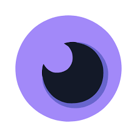
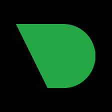
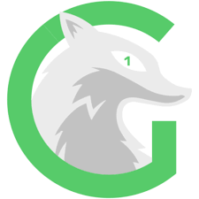
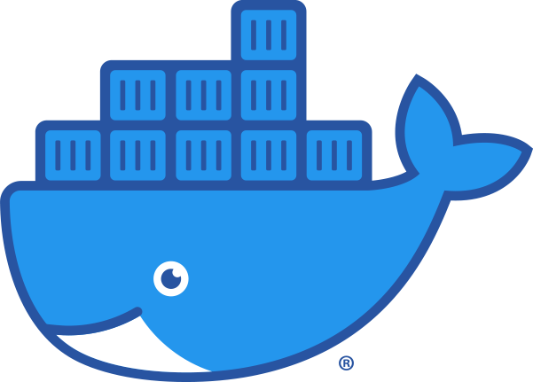

# SteamPunk Homelab

Welcome to my steampunk-inspired homelab — a self-hosted environment where infrastructure, automation, media, AI, security, and experimentation converge.  
Built on Unraid and powered by Docker, KVM virtualization, Traefik, Authentik, and Cloudflare Tunnel, this platform blends production-minded architecture with continuous iteration.

> "Not just a homelab — a living platform."

---

## Principles

- **Containerization First**: Services are deployed in isolated containers to maximize modularity, maintainability, and service recovery.
- **Secure Ingress and Traffic Control**: Reverse proxy routing, TLS termination, and middleware-based controls are used to reduce exposure and centralize traffic management.
- **Identity and Access Governance**: Protected applications can be gated through centralized authentication and policy-aware access flows.
- **Zero-Trust External Access**: Public access is minimized and selectively exposed through tunnel-based or reverse-proxied entry points.
- **Resilient Storage Architecture**: Fast cache and NVMe-backed storage are paired with a large-capacity Unraid array to support mixed workloads including media, documents, VMs, and AI pipelines.
- **Holistic Monitoring and Operations**: Dashboards, uptime checks, host telemetry, and service visibility are integrated to keep the platform observable and manageable.
- **Open-Source Ethos**: The lab emphasizes open, extensible, self-hostable tools wherever practical.
- **Continuous Optimization**: The environment is actively refined as services evolve, new tooling is added, and architecture patterns are improved.
- **Purpose-Driven Design**: Each service exists to solve a real operational, archival, automation, or experimentation need.

---

# Enterprise-Grade Homelab Infrastructure Stack

## 🎬 Media Services & Automation Pipeline

| Logo | Service | Technical Specifications |
|:----:|:--------|:-------------------------|
|  | **Jellyfin** | Primary FOSS media streaming platform with multi-library support, metadata scraping, and hardware-accelerated playback workflows. |
|  | **EmbyServer** | Secondary media platform used for parallel streaming workflows, client compatibility, and comparative media-server operation. |
|  | **Radarr** | Automated movie acquisition and management platform with quality profile enforcement and intelligent file handling. |
|  | **Radarr Anime / Kids** | Dedicated segmented Radarr instances for specialized media domains and cleaner library separation. |
|  | **Sonarr** | Episodic content automation platform for scheduled monitoring, metadata retrieval, and TV library lifecycle management. |
|  | **Sonarr Anime / Kids** | Dedicated Sonarr instances for category-specific workflows and cleaner media governance. |
|  | **Lidarr** | Music acquisition and library automation platform with artist-centric management and download pipeline integration. |
|  | **Bazarr** | Subtitle automation service with provider integration and language-specific subtitle acquisition workflows. |
|  | **Prowlarr** | Indexer aggregation and management layer used to standardize upstream search integration across media automation services. |
|  | **Overseerr** | Self-service request portal for media discovery, request approval, and library onboarding workflows. |
|  | **qBittorrentVPN** | VPN-aware torrent client with isolated download routing and integration into automated media pipelines. |
|  | **SABnzbd** | Usenet download engine integrated into automated post-processing and library import workflows. |
|  | **Unpackerr** | Automated archive extraction service for completed downloads across supported acquisition pipelines. |
|  | **Autoscan** | Event-driven scan trigger utility used to reduce delay between completed downloads and media library refresh. |
|  | **Watchstate** | Self-hosted watch-state synchronization layer for preserving viewing progress across media platforms. |

---

## 📊 Observability, Dashboards & Operations

| Logo | Service | Technical Specifications |
|:----:|:--------|:-------------------------|
|  | **Netdata** | Real-time infrastructure monitoring platform with high-frequency telemetry, host metrics, and service visibility. |
|  | **Glances** | Lightweight system observability layer providing resource usage monitoring and quick host-level diagnostics. |
|  | **Homepage** | Primary application dashboard used for service aggregation, widget-based visibility, and operational access organization. |
|  | **Dashy** | Secondary dashboard platform retained for alternate layout design and service presentation workflows. |
|  | **Uptime Kuma** | Service health and availability monitoring platform used for endpoint checks and uptime tracking. |
|  | **Speedtest Tracker** | Network monitoring service for scheduled bandwidth tests, performance history, and connectivity trend visibility. |
|  | **GoAccess-NPMLogs** | Log analytics interface for reverse-proxy-related access reporting and request visibility. |
|  | **Unraid API** | API layer used to expose operational data and enable platform-aware dashboard or automation integrations. |

---

## 🧰 Development, Remote Access & Utility Framework

| Logo | Service | Technical Specifications |
|:----:|:--------|:-------------------------|
|  | **Code-Server** | Browser-accessible development environment with extension support, remote editing, and homelab-side project workflows. |
|  | **RustDesk Server** | Self-hosted remote desktop backend for secure remote connectivity without relying on third-party relay infrastructure. |
|  | **Docker Socket Proxy** | Restricted Docker API proxy used to reduce direct socket exposure for services that require Docker metadata access. |
|  | **Adminer** | Lightweight database administration interface for direct troubleshooting and database inspection workflows. |
|  | **Krusader** | File management utility container used for direct filesystem operations and storage maintenance tasks. |

---

## ☁️ Storage, Documents & Content Management

| Logo | Service | Technical Specifications |
|:----:|:--------|:-------------------------|
|  | **Nextcloud AIO** | Comprehensive self-hosted collaboration and file platform with integrated application stack management. |
|  | **Nextcloud Collabora** | Collaborative office editing backend for in-browser document editing workflows. |
|  | **Nextcloud Talk** | Real-time communications layer for chat and voice/video collaboration inside the Nextcloud ecosystem. |
|  | **Nextcloud Whiteboard** | Collaborative whiteboarding service for shared visual workflows. |
|  | **Nextcloud Full Text Search** | Search acceleration component for deeper document indexing and retrieval workflows. |
|  | **Immich** | High-performance self-hosted photo and video management platform with dedicated database backend and optimized media workflows. |
|  | **PhotoPrism** | Secondary photo analysis and browsing platform for alternate indexing and media discovery workflows. |
|  | **Seafile** | File hosting and synchronization platform supporting efficient library-style file access and version-aware workflows. |
|  | **Paperless-NGX** | Document management system with ingestion, OCR, indexing, tagging, archival workflows, and full-text retrieval. |
|  | **Paperless-AI** | AI-assisted enrichment layer for Paperless workflows, used for automated document analysis, classification, and metadata enhancement. |
|  | **Apache Tika** | Content extraction service supporting document parsing and text extraction pipelines. |
|  | **Gotenberg** | Document-to-PDF conversion microservice used to support document processing workflows. |
|  | **Stirling-PDF** | PDF transformation and utility platform for manipulation, cleanup, and general document workflow support. |

---

## 🤖 Local AI, Voice & Assistant Infrastructure

| Logo | Service | Technical Specifications |
|:----:|:--------|:-------------------------|
|  | **Ollama** | Local LLM inference runtime providing self-hosted model execution for AI-assisted homelab workflows. |
|  | **Open WebUI** | Browser-based AI interface layer for interacting with local models and connected AI services. |
|  | **faster-whisper** | Optimized speech-to-text service using accelerated Whisper inference for local transcription workloads. |
|  | **Piper** | Local neural text-to-speech engine for voice synthesis and assistant integrations. |
|  | **openWakeWord** | Wake-word detection service used as part of local assistant and voice-triggered workflows. |

---

## 🏠 Photos, Cameras & Smart Environment

| Logo | Service | Technical Specifications |
|:----:|:--------|:-------------------------|
|  | **Frigate** | NVR and camera analytics platform supporting real-time event detection, recording, and surveillance workflows. |
|  | **Home Assistant** | Smart home automation platform used for device orchestration, dashboards, and household automation logic. |
|  | **HomeAssistant_inabox** | Containerized management/support component for Home Assistant-related workflows within the broader Unraid ecosystem. |

---

## 🔒 Network Security, Identity & Access Control

| Logo | Service | Technical Specifications |
|:----:|:--------|:-------------------------|
|  | **Traefik** | Primary reverse proxy handling dynamic routing, middleware application, and HTTPS ingress management. |
|  | **Authentik** | Identity provider used for centralized authentication, access workflows, and protected application entry points. |
|  | **CrowdSec** | Collaborative security engine for behavioral analysis and dynamic response to hostile traffic patterns. |
|  | **CrowdSec Traefik Bouncer** | Enforcement layer integrating CrowdSec decisions with reverse-proxy request handling. |
|  | **Pi-hole** | Network-level DNS filtering platform for ad/tracker suppression and DNS visibility. |
|  | **Unbound** | Recursive validating resolver paired with Pi-hole for local DNS resolution and DNSSEC-aware query handling. |
|  | **Cloudflare Tunnel** | Outbound-only secure publishing layer used to expose selected services without broad inbound exposure. |

---

## 🗄️ Database & Persistence Layer

| Logo | Service | Technical Specifications |
|:----:|:--------|:-------------------------|
|  | **PostgreSQL** | Relational database layer supporting services such as Authentik, Paperless, and other application backends. |
|  | **PostgreSQL + pgvecto-rs** | Vector-capable PostgreSQL implementation supporting Immich-related storage and advanced indexing workflows. |
|  | **MariaDB** | Relational database engine used by selected application stacks including file and content services. |
|  | **Redis** | In-memory caching and transient data layer supporting service responsiveness and queue/cache workflows. |

---

## 🖥️ Virtualization Infrastructure

| Logo | Operating System / Platform | Technical Implementation |
|:----:|:----------------------------|:-------------------------|
|  | **Windows 11 Ghost 25H2** | Active VM used for Windows-based workflows inside the Unraid virtualization layer. |
|  | **Home Assistant VM** | Dedicated virtual machine used for primary smart-home automation workloads. |
|  | **Fedora** | Offline lab VM retained for Linux workstation and experimentation workflows. |
|  | **Kali** | Security-focused VM used for testing and isolated lab activities. |
|  | **macOS Ventura** | Offline virtualization workload retained for platform-specific experimentation. |
|  | **Windows 11 - Hyperspin 23H2** | Specialty Windows VM for gaming/front-end experimentation. |
|  | **Windows 11 Ghost 2025** | Additional Windows VM retained as part of the broader lab platform. |

### Unraid Virtualization Layer

The virtualization layer is hosted on Unraid using KVM/QEMU and complements the container stack by supporting workloads that benefit from full guest isolation, OS-level testing, specialty applications, and smart-home services.

This hybrid model allows the lab to combine:
- container efficiency for always-on service delivery
- VM isolation for desktop, testing, and specialty workloads
- flexible storage placement across cache, array, and NVMe-backed paths
- direct coexistence with media, automation, and infrastructure services

---

# 📈 Storage Architecture

Storage is split across cache, array, and dedicated workload-specific paths. Appdata is heavily cache-backed, document workflows use dedicated structured shares, and some performance-sensitive services use separate NVMe-backed locations.

---

# 🛡️ Docker Application Architecture

Most application containers operate on the `steampunknet` custom Docker network, while dedicated stacks such as Nextcloud AIO and Seafile use their own isolated networks. Select infrastructure services also run on `host`, `bridge`, or `br0` where appropriate.

---

# Documentation

Architecture and Core
- [Architecture](docs/architecture.md)
- [Platform Map](docs/architecture-map.md)
- [Security and Access Model](docs/security.md)
- [Storage Architecture](docs/storage.md)
- [Monitoring and Operations](docs/monitoring.md)
- [Virtualization](docs/virtualization.md)

Service Stacks
- [Media Stack](docs/media-stack.md)
- [Media Stack Map](docs/media-stack-map.md)
- [Paperless Document Stack](docs/paperless.md)
- [Nextcloud Stack](docs/nextcloud.md)
- [AI Stack](docs/ai-stack.md)
- [Photos, Cameras, and Smart Home](docs/photos-smart-home.md)

Inventory
- [Application Inventory](docs/inventory.md)
- [Share Inventory](docs/shares.md)
- [Network Inventory](inventory/networks)

# 🙏 Credits & Inspiration

This homelab did not come together in a vacuum. A lot of what I built was influenced by the self-hosting community — especially the creators who share their knowledge through videos, walkthroughs, and real-world examples.

## Biggest Influences

- **[Spaceinvader One](https://www.youtube.com/@SpaceinvaderOne)** — The biggest influence on this build by far. His Unraid content helped shape a large part of how I approached containers, storage, virtualization, and homelab design.
- **[IBRACORP](https://www.youtube.com/@IBRACORP)** — Inspiration for cleaner service architecture, reverse proxy design, and security-minded self-hosting.
- **[AlienTech42](https://www.youtube.com/@AlienTech42)** — Great source of ideas for practical homelab workflows and service exploration.
- **[Christian Lempa](https://www.youtube.com/@christianlempa)** — Inspiration for infrastructure thinking, self-hosting mindset, and polished homelab presentation.
- **[Techno Tim](https://www.youtube.com/@TechnoTim)** — Helpful inspiration for self-hosting, automation, and discovering new tools and ideas.

A sincere thank you to the broader open-source and self-hosting community for making learning and building projects like this possible.

# 🏅 Badges

---

# 📝 Notes

This homelab is an evolving ecosystem — part production platform, part engineering playground, and part long-term digital infrastructure project.  
It is continuously updated as new services are introduced, older ones are retired, and architecture decisions are refined over time.
