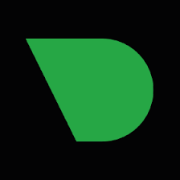
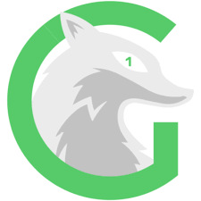

# 🚀 SteamPunk Homelab

Welcome to my cyberpunk-themed homelab — a playground where learning, automation, and entertainment collide.  
Powered by Unraid, Docker, and secured through Traefik and Cloudflare Tunnels, this environment balances serious production reliability with a spirit of experimentation.

> "It's not just a homelab — it's a lifestyle."

---

## 🛡️ Principles

- All services run in **Docker containers**.
- **Traefik** is used as the ingress controller and reverse proxy.
- **Cloudflare Tunnel** securely exposes select apps without open ports.
- **Unraid** provides simple, flexible storage management.
- Monitoring, automation, and backup services run across **NVMe cache pools** and a robust **array** of HDDs.
- Preference for **open-source** solutions wherever possible.
- Secrets and sensitive configs are separated and minimized for security.

---

## 🛠️ Setup Overview

- **Server:** AMD Ryzen 7 5800X - 8 cores / 16 threads
- **Memory:** 96GB DDR4
- **Storage:**
  - 2 × 4TB NVMe Cache Drives
  - Mixed 16TB, 8TB, and 4TB HDD Array
- **Virtualization:** AMD-V Enabled
- **OS:** Unraid 6.6.78

---

# 📦 Application Stack

### 🎬 Media Stack

| Logo | Application | Description |
|:----:|:------------|:------------|
|  | **Jellyfin** | Open-source personal media server. |
|  | **EmbyServer** | Media server with advanced metadata support. |
|  | **Tautulli** | Monitoring for Plex/Emby activity. |
|  | **Radarr** | Automated movie collection management. |
|  | **Sonarr** | Automated TV show downloading and organization. |
|  | **Overseerr** | Request management system for media libraries. |
|  | **Recyclarr** | Syncs Radarr/Sonarr quality profiles automatically. |

---

### 📊 Monitoring Stack

| Logo | Application | Description |
|:----:|:------------|:------------|
|  | **Netdata** | Real-time system monitoring and alerts. |
|  | **Glances** | Cross-platform system monitor. |
|  | **Homepage** | Dashboard for organizing self-hosted services. |
|  | **Dashy** | Dashboard focused on app links and widgets. |
|  | **Speedtest Tracker** | Internet connection monitoring. |

---

### 🧰 Utilities Stack

| Logo | Application | Description |
|:----:|:------------|:------------|
|  | **Code-Server** | Web-based VSCode IDE. |
|  | **RustDesk Server** | Self-hosted remote desktop solution. |
|  | **Docker Socket Proxy** | Secure docker.sock access. |

---

### ☁️ Cloud / Storage Stack

| Logo | Application | Description |
|:----:|:------------|:------------|
|  | **Nextcloud AIO** | Personal cloud platform for storage, collaboration, and backup. |
|  | **Immich** | High-speed AI-powered photo backup service. |
|  | **PhotoPrism** | Private photo management platform. |
|  | **Syncthing** | Decentralized peer-to-peer file sync. |

---

### 🔒 Security Stack

| Logo | Application | Description |
|:----:|:------------|:------------|
|  | **Traefik** | Dynamic reverse proxy with SSL support. |
|  | **Authentik** | SSO and Identity provider. |
|  | **CrowdSec** | Collaborative IPS security tool. |
|  | **Pi-hole** | DNS-level ad-blocker for the entire network. |
|  | **Unbound** | Local DNS resolver. |
|  | **Cloudflare Tunnel** | Securely connects homelab services to the public internet. |

---

### 🗄️ Database Stack

| Logo | Application | Description |
|:----:|:------------|:------------|
|  | **PostgreSQL** | Database for Authentik and Immich. |
|  | **MariaDB** | Database for Nextcloud. |
|  | **Redis** | In-memory database and cache. |

---

# 📈 Storage Architecture

---

# 🛡️ Docker Application Architecture

---

# 🏅 Badges

  
  
  

---

# 📝 Notes

This homelab is an evolving ecosystem — balancing real-world production practices with a passion for learning, self-hosting, and automation at home.

---
